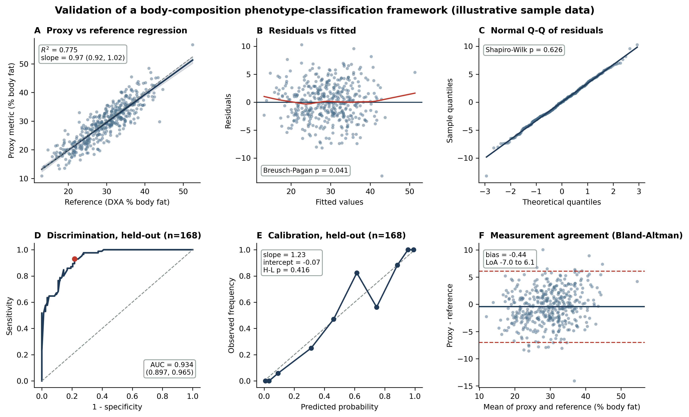

# Validating a Body-Composition Phenotype-Classification Framework

A small, fully reproducible example of **validating a classification framework** (as opposed to merely
training a classifier): regression with a full assumption-diagnostics battery, measurement-agreement
analysis, and **out-of-sample** discrimination and calibration.

The data are synthetic and illustrative. Every statistic in the report and in the figure is computed by
`main.py` and written to `results.json`, then injected into `sample_report.html` so no number is
hand-typed.



**Figure 1.** (A) OLS regression of a field proxy on the reference method with 95% CI band and identity
line. (B) Residuals vs fitted with a LOWESS smoother. (C) Normal Q-Q of residuals. (D) ROC on a held-out
validation set. (E) Calibration curve by decile. (F) Bland-Altman measurement agreement.

## What it demonstrates

- **Regression diagnostics** - linearity (residual-vs-fitted, LOWESS), homoscedasticity (Breusch-Pagan),
  residual normality (Shapiro-Wilk, Q-Q), independence (Durbin-Watson), influence (Cook's distance),
  multicollinearity (VIF).
- **Measurement science** - Bland-Altman bias and 95% limits of agreement, with a proportional-bias test.
- **Classification-framework validation** - model developed on a 60% development set and evaluated on a
  held-out 40% validation set: discrimination (AUC with bootstrap 95% CI), calibration (calibration curve,
  slope, calibration-in-the-large, Hosmer-Lemeshow), and a Youden-optimal operating point.

## Key result (held-out validation, n = 168)

Strong discrimination (AUC 0.934, 95% CI 0.897 to 0.965) and acceptable calibration (Hosmer-Lemeshow
p = 0.416), but wide Bland-Altman limits of agreement and significant proportional bias: the proxy is
valid for **classifying** the high-adiposity phenotype yet is **not interchangeable** with the reference
for individual measurement. Discrimination alone would hide that gap.

## Run it

```bash
pip install -r requirements.txt
python main.py          # writes figure1_validation.{png,svg} and results.json
python build_report.py  # writes sample_report.html
```

---
Dr. Sandeep Grover - PhD, data science. 20+ peer-reviewed publications in statistical inference, genetic
epidemiology, and classification validation.
